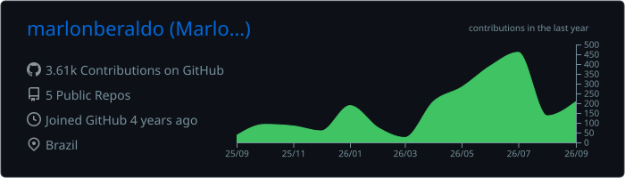
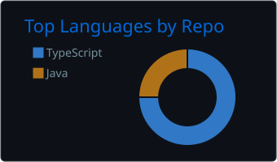
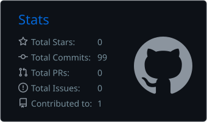

# Hey, I'm Marlon 👋

### Full Stack Developer building production-ready web products with TypeScript.

  
  

---

## 👨‍💻 About me

I'm a Full Stack Developer from Paraná, Brazil, and a Computer Engineering graduate from UEPG.

I have more than three years of experience across front-end and full-stack development, including technical leadership and the delivery of production systems.

My work focuses on transforming business requirements into reliable digital products — from responsive interfaces to APIs, authentication flows, payment integrations, dashboards and data layers.

* 🔭 Building applications with **Next.js, React, TypeScript and Tailwind CSS**
* ⚙️ Developing APIs and back-end systems with **Node.js, Fastify, GraphQL and PostgreSQL**
* 🗄️ Working with **Supabase, Drizzle ORM and Prisma**
* 🌱 Currently deepening my knowledge of **NestJS, Neon and back-end architecture**
* ☁️ Exploring serverless applications with **AWS and DynamoDB**
* 🛹 Outside of code, I enjoy skateboarding, running and going to the gym

---

## 🛠️ Tech stack

  

  
  
  
  
  
  

---

## 🚀 Featured projects

| Project                                                                                                | Description                                                                                                                                 | Main technologies                                 |
| ------------------------------------------------------------------------------------------------------ | ------------------------------------------------------------------------------------------------------------------------------------------- | ------------------------------------------------- |
| [**Recanto do Trovador**](https://portfolio-marlon-beraldo.vercel.app/en/projects/recanto-do-trovador) | Booking platform with automatic reservation expiration, dynamic pricing, coupons, passwordless authentication and Pix/credit-card payments. | Next.js, TypeScript, GraphQL, Drizzle, Supabase   |
| [**Voto Radar**](https://portfolio-marlon-beraldo.vercel.app/en/projects/voto-radar)                   | Electoral research platform delivered in three weeks that received approximately 1,500 participants within its first two days.              | Next.js, TypeScript, PostgreSQL, Supabase, Prisma |
| [**M3H Construtora**](https://portfolio-marlon-beraldo.vercel.app/en/projects/m3h-construtora)         | Full-stack platform where clients track construction progress, invoices, visits and documents through a dedicated dashboard.                | Next.js, Node.js, Fastify, PostgreSQL, Supabase   |
| [**Watanabe**](https://portfolio-marlon-beraldo.vercel.app/en/projects/watanabe)                       | Multilingual institutional platform with personalized client catalogs, temporary authentication and automatic file cleanup.                 | Next.js, GraphQL, WordPress, Supabase, TypeScript |

---

## 📊 GitHub overview

  

  
  

  

---

### Let's build something great.

[Portfolio](https://portfolio-marlon-beraldo.vercel.app/en) · [LinkedIn](https://linkedin.com/in/marlon-beraldo) · [GitHub](https://github.com/marlonberaldo)

